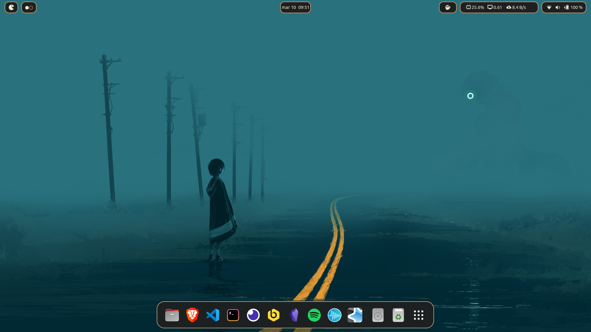
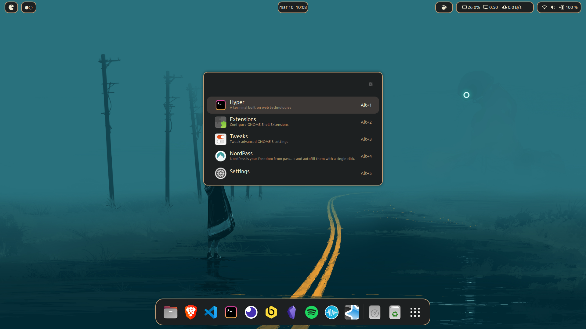
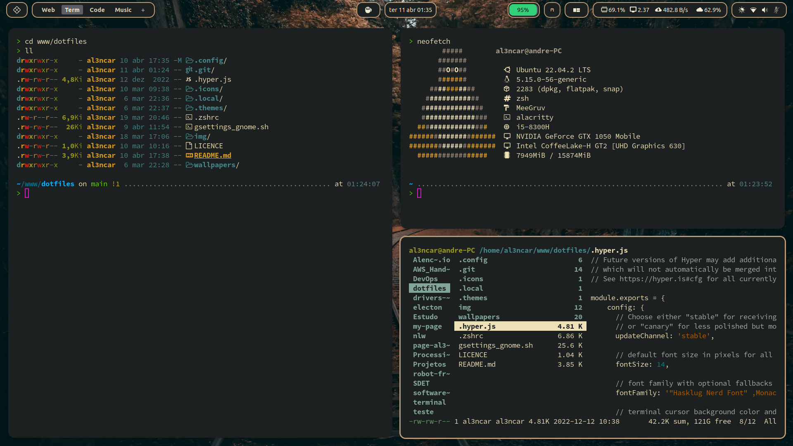
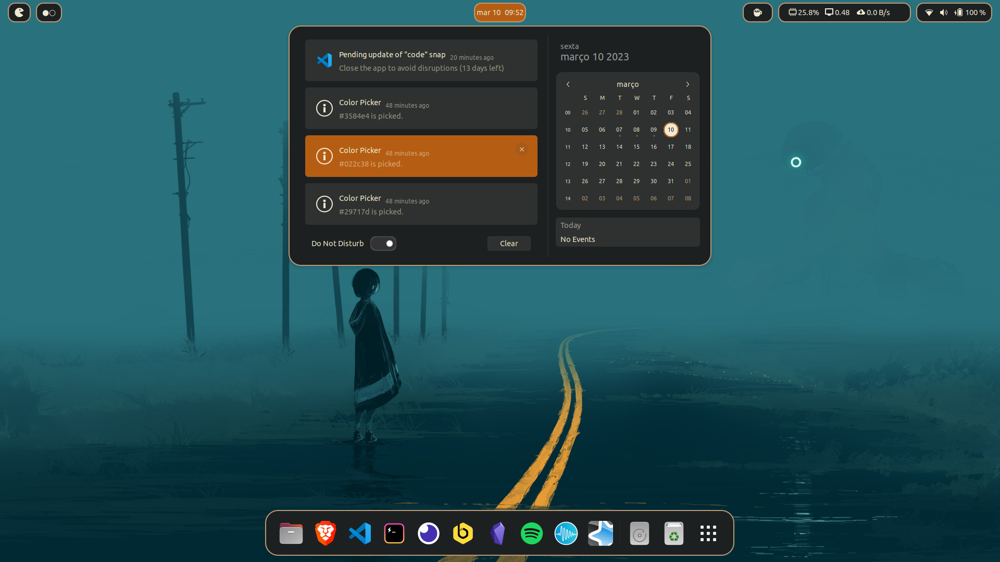
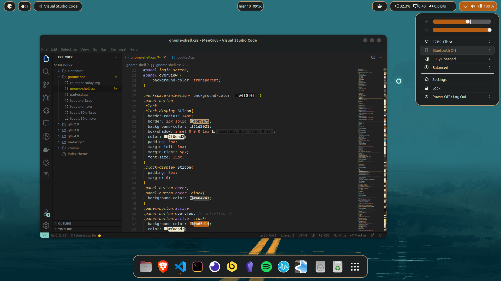
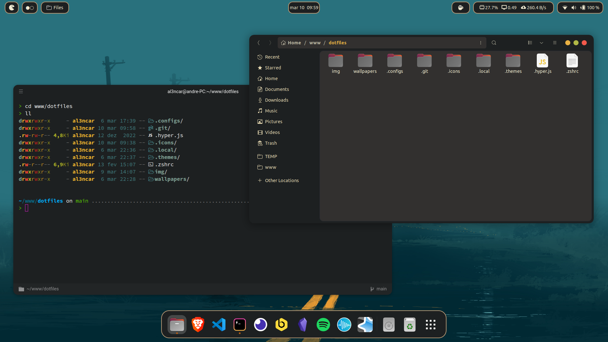
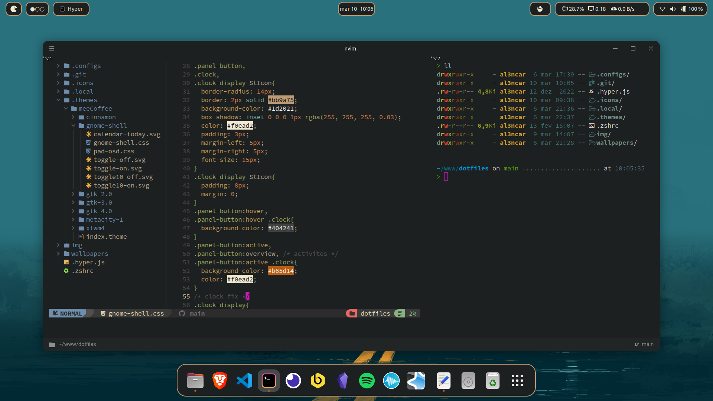
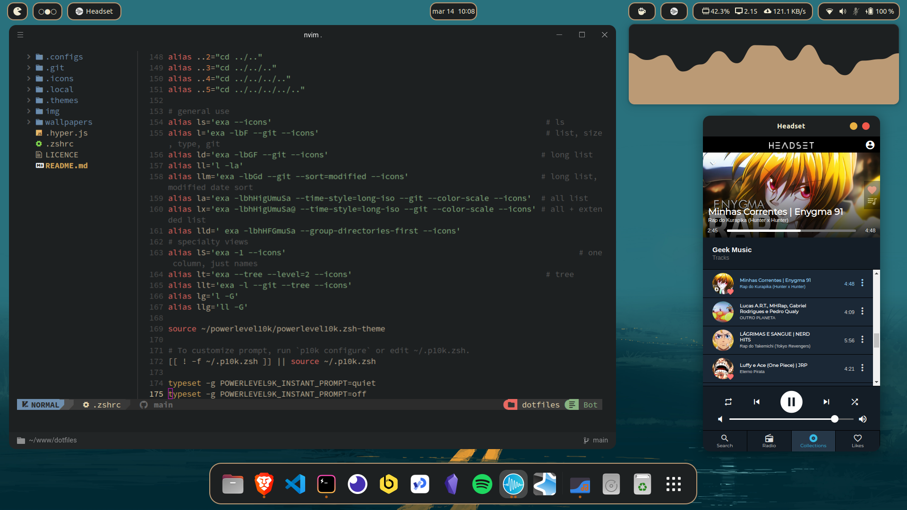

# dotfiles

Personal Dotfiles - Ubuntu 22.04 LTS / Gnome 42.5











## Info

---

### Plugins

- ArcMenu
- Blur my Shell
- Caffeine
- Impatience
- Just Perfection
- Launch new instance
- Mpris Indicator Button
- No Titlebar When Maximized
- Rounded Window Sizer
- User Themes
- Vitals
- WindowNavigator  
- WinTile: Windows 10 window tiling for GNOME
- Workspace Indicator

### Cursor

- [Bibata-Modern-Classic](https://github.com/ful1e5/Bibata_Cursor)

### Icon

- Yaru (default ubuntu)

### Launcher apps

- [Ulauncher](https://ulauncher.io/)
- [theme ulauncher](https://github.com/Alencar26/dotfiles/tree/main/.local/share/ulauncher)

### Terminal

- [Hyper terminal](https://hyper.is/)

- [hyper.js](https://github.com/Alencar26/dotfiles/blob/main/.hyper.js)

- Plugins
  
  ```javascript
  plugins: [
      "hyper-tabs-enhanced",
      //"hyperterm-atom-dark",
      "hypercwd",
      "hyperterm-paste",
      "hyper-statusline",
      "hyperterm-summon",
      "hyper-pane",
  
  ]
  ```

### Neovim

- [NvChad](https://github.com/NvChad/NvChad)

### Theme

- [link](https://github.com/Alencar26/dotfiles/tree/main/.themes)

- inspired by gruvbox
  
  ### Wallpapers
  
  - [wallpapers](https://github.com/Alencar26/dotfiles/tree/main/wallpapers)

### Music's Apps

- [Cavalier](https://github.com/fsobolev/cavalier)
    - [config cavaliere](https://github.com/Alencar26/dotfiles/tree/main/.configs/cavalier)
- [Moosync](https://github.com/Moosync/Moosync)
- [Headset](https://headsetapp.co/)

### Apps
 - [pomodoro](https://gnomepomodoro.org/)
