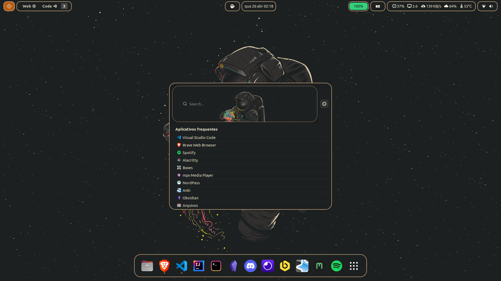
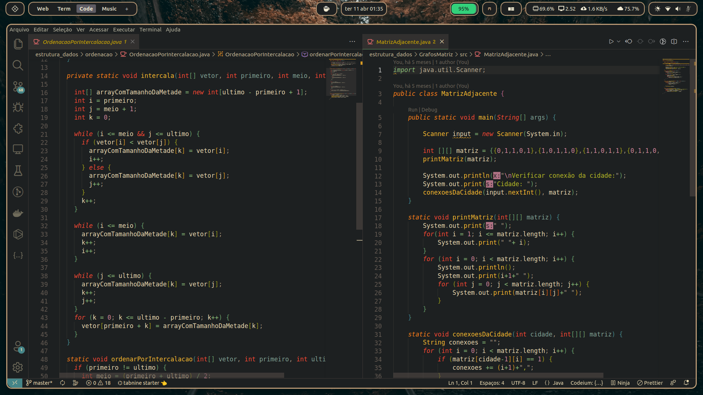
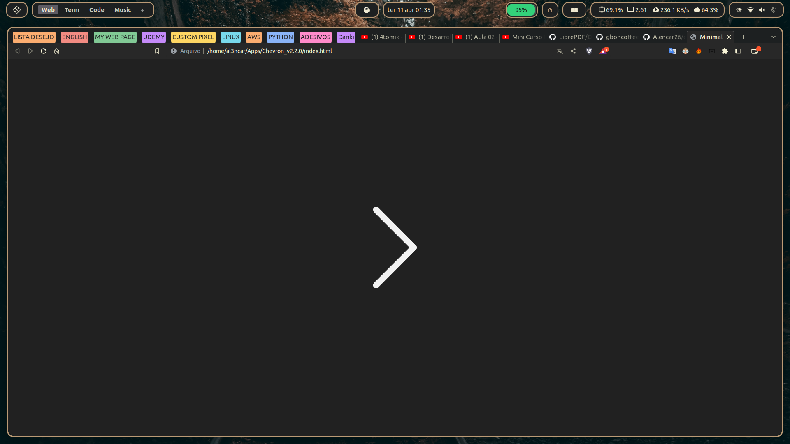
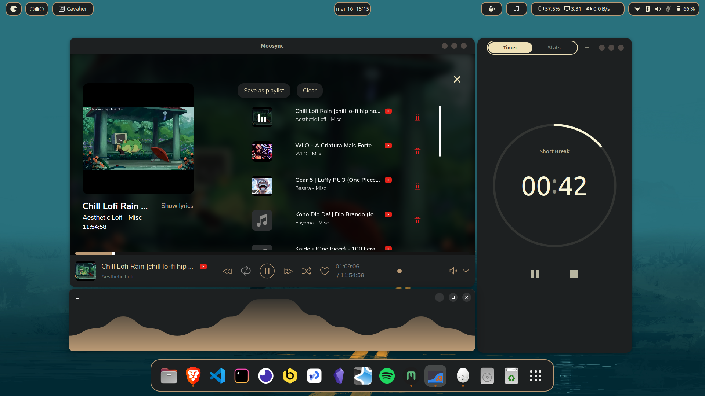
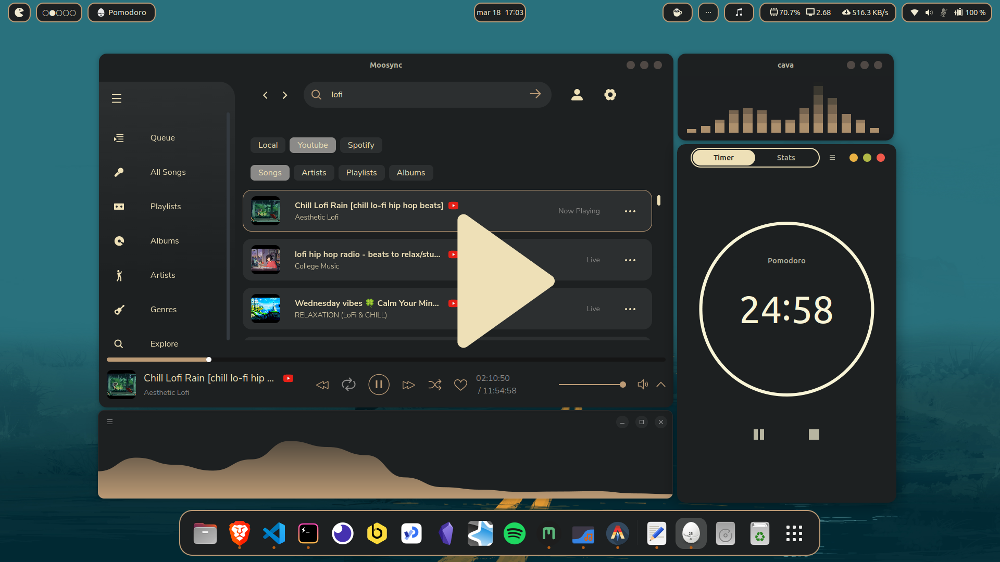

# dotfiles - MeeCoffee

Personal Dotfiles - Ubuntu 22.04 LTS / Gnome 42.5








---

Old workspace video:
[](https://www.youtube.com/watch?v=0hiZ8z1fzGI)
## Info

---

### Plugins

- [ArcMenu](https://extensions.gnome.org/extension/3628/arcmenu/)
- [Aylur's Widgets](https://extensions.gnome.org/extension/5338/aylurs-widgets/)
- [Space Bar](https://extensions.gnome.org/extension/5090/space-bar/)
- [Top Bar Organizer](https://extensions.gnome.org/extension/4356/top-bar-organizer/)
- [Blur my Shell](https://extensions.gnome.org/extension/3193/blur-my-shell/)
- [Caffeine](https://extensions.gnome.org/extension/517/caffeine/)
- [Impatience](https://extensions.gnome.org/extension/277/impatience/)
- [Just Perfection](https://extensions.gnome.org/extension/3843/just-perfection/)
- [Rounded Window Sizer](https://extensions.gnome.org/extension/5237/rounded-window-corners/)
- [User Themes](https://extensions.gnome.org/extension/19/user-themes/)
- [Unite](https://github.com/hardpixel/unite-shell)
- [Vitals](https://extensions.gnome.org/extension/1460/vitals/) 
- [Pop-Shell](https://github.com/pop-os/shell)

### Config gsettings
  - [gsettings conf](https://github.com/Alencar26/dotfiles/blob/main/gsettings_gnome.sh)
### Cursor
- [Bibata-Modern-Classic](https://github.com/ful1e5/Bibata_Cursor)

### Icon
- Yaru (default ubuntu)

### Launcher apps
- [Ulauncher](https://ulauncher.io/)
  - [ulauncher-theme](https://github.com/Alencar26/dotfiles/tree/main/.local/share/ulauncher)

### Terminal
- [Alacritty](https://github.com/alacritty/alacritty)
- [Hyper terminal](https://hyper.is/)
  - [hyper.js](https://github.com/Alencar26/dotfiles/blob/main/.hyper.js)

- Plugins hyper
  
  ```javascript
  plugins: [
      "hyper-tabs-enhanced",
      //"hyperterm-atom-dark",
      "hypercwd",
      "hyperterm-paste",
      "hyper-statusline",
      "hyperterm-summon",
      "hyper-pane"
  ]
  ```
### Shell
  - [ZSH](https://github.com/ohmyzsh/ohmyzsh/wiki/Installing-ZSH)
  - [oh my zsh](https://github.com/ohmyzsh/ohmyzsh)
    - oh my zsh plugins:
      - [git](https://github.com/ohmyzsh/ohmyzsh/tree/master/plugins/git)
      - [git-flow](https://github.com/ohmyzsh/ohmyzsh/tree/master/plugins/git-flow)
      - [compleat](https://github.com/ohmyzsh/ohmyzsh/tree/master/plugins/compleat)
      - [zsh-autosuggestions](https://github.com/zsh-users/zsh-autosuggestions)
      - [zsh-completions](https://github.com/clarketm/zsh-completions)
      - [k](https://github.com/supercrabtree/k)
  - [Powerlevel10k](https://github.com/romkatv/powerlevel10k)
  - [bat](https://github.com/sharkdp/bat)
  - [exa](https://github.com/ogham/exa)
    - [exa site](https://the.exa.website/)
  - [nnn](https://github.com/jarun/nnn)
  - [ranger](https://github.com/ranger/ranger)
  - [gitql](https://github.com/filhodanuvem/gitql)
  
### Neovim
- [NvChad](https://github.com/NvChad/NvChad)

### Gnome Theme
- [link](https://github.com/Alencar26/dotfiles/tree/main/.themes)

- inspired by gruvbox
  
### Wallpapers
  - [wallpapers](https://github.com/Alencar26/dotfiles/tree/main/wallpapers)

### Music's Apps
- [Moosync](https://github.com/Moosync/Moosync)
    - [moosync-theme](https://github.com/Alencar26/dotfiles/tree/main/.configs/moosync-theme)
- [Headset](https://headsetapp.co/)

### Audio Visualizer
- [Cavalier](https://github.com/fsobolev/cavalier)
    - [cavaliere config/theme](https://github.com/Alencar26/dotfiles/tree/main/.configs/cavalier)

- [cava](https://github.com/karlstav/cava)
    - [cava config/theme](https://github.com/Alencar26/dotfiles/tree/main/.configs/cava)

### Apps
 - [pomodoro](https://gnomepomodoro.org/)
