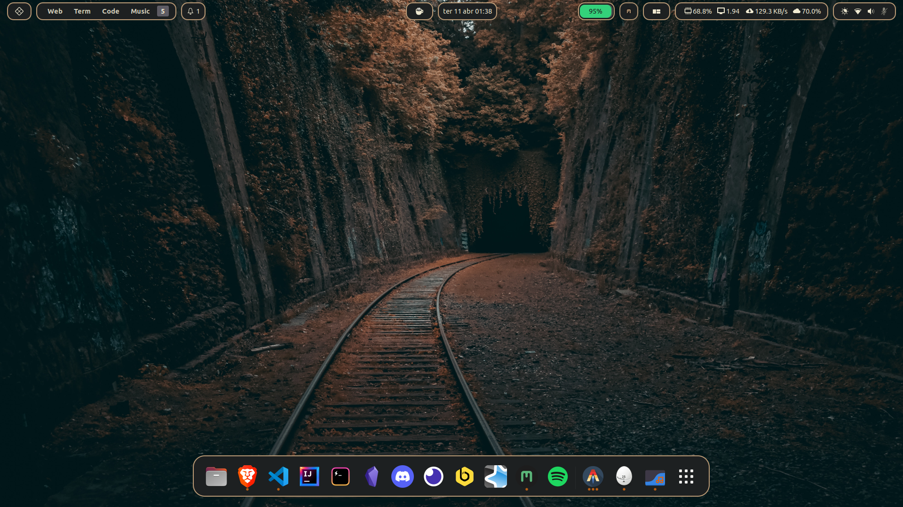
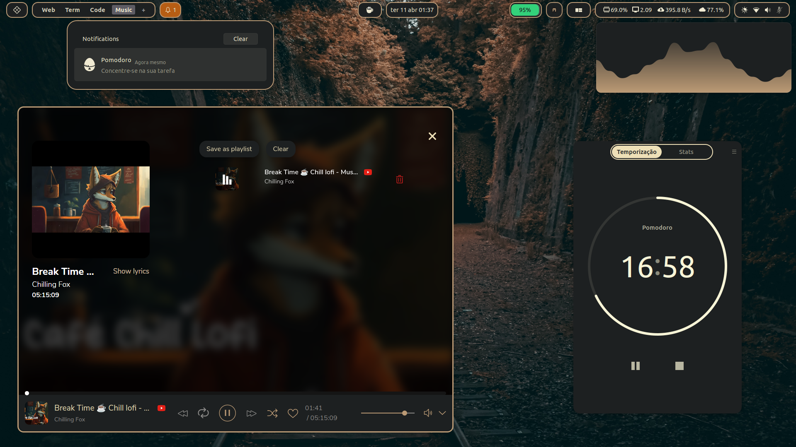

# dotfiles - MeeCoffee

Personal Dotfiles - Ubuntu 22.04 LTS / Gnome 42.5

Video youtube:
[](https://www.youtube.com/watch?v=0hiZ8z1fzGI)






## Info

---

### Plugins

- ArcMenu
- Blur my Shell
- Caffeine
- Impatience
- Just Perfection
- Launch new instance
- Mpris Indicator Button
- No Titlebar When Maximized
- Rounded Window Sizer
- User Themes
- Vitals
- WindowNavigator  
- WinTile: Windows 10 window tiling for GNOME
- Workspace Indicator

### Cursor
- [Bibata-Modern-Classic](https://github.com/ful1e5/Bibata_Cursor)

### Icon
- Yaru (default ubuntu)

### Launcher apps
- [Ulauncher](https://ulauncher.io/)
  - [ulauncher-theme](https://github.com/Alencar26/dotfiles/tree/main/.local/share/ulauncher)

### Terminal
- [Hyper terminal](https://hyper.is/)
  - [hyper.js](https://github.com/Alencar26/dotfiles/blob/main/.hyper.js)

- Plugins
  
  ```javascript
  plugins: [
      "hyper-tabs-enhanced",
      //"hyperterm-atom-dark",
      "hypercwd",
      "hyperterm-paste",
      "hyper-statusline",
      "hyperterm-summon",
      "hyper-pane"
  ]
  ```
### Shell
  - [ZSH](https://github.com/ohmyzsh/ohmyzsh/wiki/Installing-ZSH)
  - [oh my zsh](https://github.com/ohmyzsh/ohmyzsh)
    - oh my zsh plugins:
      - [git](https://github.com/ohmyzsh/ohmyzsh/tree/master/plugins/git)
      - [git-flow](https://github.com/ohmyzsh/ohmyzsh/tree/master/plugins/git-flow)
      - [compleat](https://github.com/ohmyzsh/ohmyzsh/tree/master/plugins/compleat)
      - [zsh-autosuggestions](https://github.com/zsh-users/zsh-autosuggestions)
      - [zsh-completions](https://github.com/clarketm/zsh-completions)
      - [k](https://github.com/supercrabtree/k)
  - [Powerlevel10k](https://github.com/romkatv/powerlevel10k)
  - [bat](https://github.com/sharkdp/bat)
  - [exa](https://github.com/ogham/exa)
    - [exa site](https://the.exa.website/)
  - [nnn](https://github.com/jarun/nnn)
  - [ranger](https://github.com/ranger/ranger)
  - [gitql](https://github.com/filhodanuvem/gitql)
  
### Neovim
- [NvChad](https://github.com/NvChad/NvChad)

### Theme
- [link](https://github.com/Alencar26/dotfiles/tree/main/.themes)

- inspired by gruvbox
  
### Wallpapers
  - [wallpapers](https://github.com/Alencar26/dotfiles/tree/main/wallpapers)

### Music's Apps
- [Moosync](https://github.com/Moosync/Moosync)
    - [moosync-theme](https://github.com/Alencar26/dotfiles/tree/main/.configs/moosync-theme)
- [Headset](https://headsetapp.co/)

### Audio Visualizer
- [Cavalier](https://github.com/fsobolev/cavalier)
    - [cavaliere config/theme](https://github.com/Alencar26/dotfiles/tree/main/.configs/cavalier)

- [cava](https://github.com/karlstav/cava)
    - [cava config/theme](https://github.com/Alencar26/dotfiles/tree/main/.configs/cava)

### Apps
 - [pomodoro](https://gnomepomodoro.org/)
